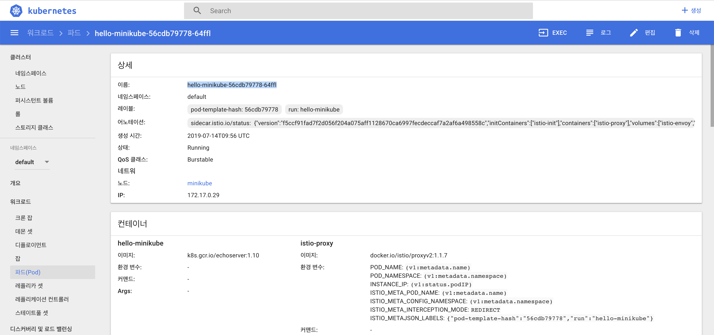
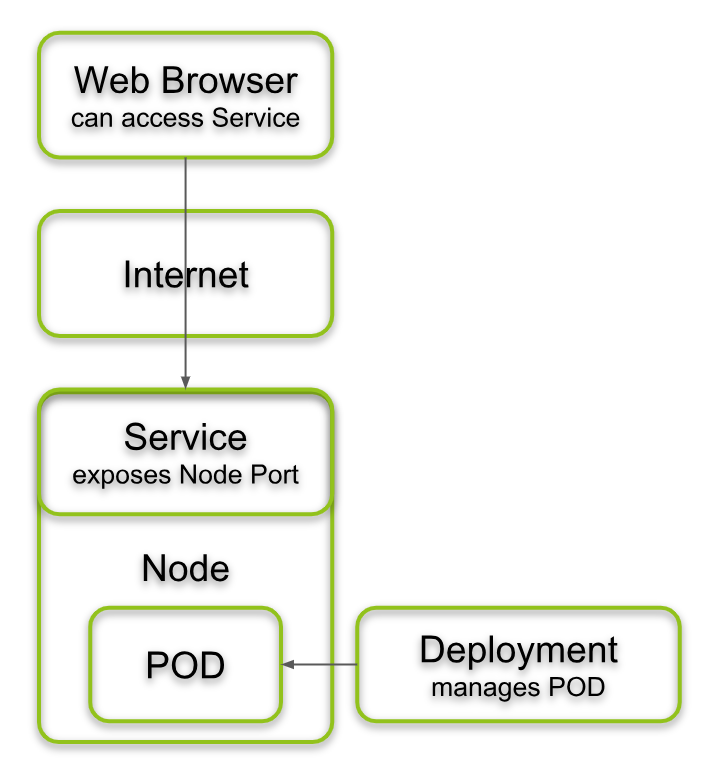

# 2.1.3 Minikube 빠른 시작

지금까지 Minikube 주요 기능과 설치 가이드를 통해 테스트/개발 하기 위한 환경구축 방법에 대해 소개했습니다. 지금부터는 Minikube 에서 제공하는 다양한 기능과 kubectl CLI 도구를 이용하여 Minikube 클러스터를 제어하기 위한 방법에 대해 소개하겠습니다.

## Minikube 실행

Minikube 실행여부를 확인하고, Running 상태가 아니라면 minikube start 명령을 통해 실행합니다. Minikube 실행 결과를 보면 OSX\(darwin\) 환경에서 실행되고, Docker Engine\(18.09.6\) 위에 Kubernetes v1.14.3 가 정상 실행된 것을 확인할 수 있습니다.

* Minikube 상태 확인

  ```text
  $ minikube status
  host: Stopped
  kubelet:
  apiserver:
  kubectl:
  ```

* Minikube 실행

```text
$ minikube start

😄  minikube v1.1.1 on darwin (amd64)
⚠️  Ignoring --vm-driver=virtualbox, as the existing "minikube" VM was created using the hyperkit driver.
⚠️  To switch drivers, you may create a new VM using `minikube start -p <name> --vm-driver=virtualbox`
⚠️  Alternatively, you may delete the existing VM using `minikube delete -p minikube`

🔄  Restarting existing hyperkit VM for "minikube" ...
⌛  Waiting for SSH access ...
🐳  Configuring environment for Kubernetes v1.14.3 on Docker 18.09.6
🔄  Relaunching Kubernetes v1.14.3 using kubeadm ...
```

## Kubernetes 디플로이먼트 생성

kubectl을 이용하여 echoserver 이미지를 사용하여 Kubernetes Deployment를 생성합니다. 서비스 디플로이먼트 이름은 hello-minikube 으로 설정하였고, --port 옵션을 사용하여 8080 포트번호로 외부에 노출합니다.

```text
$ kubectl run hello-minikube --image=k8s.gcr.io/echoserver:1.10 --port=8080
kubectl run --generator=deployment/apps.v1 is DEPRECATED and will be removed in a future version. Use kubectl run --generator=run-pod/v1 or kubectl create instead.
deployment.apps/hello-minikube created
```

## 서비스 노출

hello-minikube 디플로이먼트에 엑세스하기 위해 expose 명령어를 사용하여 서비스로 노출합니다. 외부 서비스로 노출하기 위해 --type=NodePort 타입을 지정합니다.

```text
$ kubectl expose deployment hello-minikube --type=NodePort
service/hello-minikube exposed
```

## 서비스 구동 확인

hello-minikube Pod가 실행되고 있는 중이고, Pod가 정상적으로 실행되어 구동중인지 확인이 필요합니다. 아래와 같이 hello-minikybe Pod 2개가 12분 전에 실행되었고, 모두 실행중인 상태를 확인할 수 있습니다. STTUS=ContainerCreating 상태로 보일 경우, 아직 Pod가 생성중임을 나타내는 것이고 잠시 후에 Running 상태로 변하게 됩니다.

```text
$ kubectl get pod
NAME                              READY   STATUS    RESTARTS   AGE
hello-minikube-56cdb79778-64ffl   2/2     Running   0          12m
```

## 서비스 상세정보 확인

hello-minikube 서비스에 접속하기 위한 url 정보를 얻습니다. Node IP\(192.168.64.2\)와 노출된 외부 서비스 포트\(31546\)을 확인할 수 있습니다. 브라우저를 띄운후 [http://192.168.64.2:31546](http://192.168.64.2:31546) URL로 접속하면 echoserver 서버로부터 받은 응답메시를 확인할 수 있습니다.

```text
$ minikube service hello-minikube --url
http://192.168.64.2:31546
```

아래와 같이 echoserver로부터 받은 응답메시를 확인할 수 있습니다.

```text
Hostname: hello-minikube-56cdb79778-64ffl

Pod Information:
    -no pod information available-

Server values:
    server_version=nginx: 1.13.3 - lua: 10008

Request Information:
    client_address=127.0.0.1
    method=GET
    real path=/
    query=
    request_version=1.1
    request_scheme=http
    request_uri=http://192.168.64.2:8080/

Request Headers:
    accept=text/html,application/xhtml+xml,application/xml;q=0.9,image/webp,image/apng,*/*;q=0.8,application/signed-exchange;v=b3
    accept-encoding=gzip, deflate
    accept-language=ko-KR,ko;q=0.9,en-US;q=0.8,en;q=0.7
    connection=keep-alive
    dnt=1
    host=192.168.64.2:31546
    upgrade-insecure-requests=1
    user-agent=Mozilla/5.0 (Macintosh; Intel Mac OS X 10_14_5) AppleWebKit/537.36 (KHTML, like Gecko) Chrome/75.0.3770.100 Safari/537.36

Request Body:
    -no body in request-
```

hello-minikube 서비스에 대한 자세한 정보는 minikube dashboard 기능을 통해서도 확인 가능합니다. 아래와 같이 대시보드를 실행한 후, 왼쪽 메뉴에서 워크로드-&gt;파드\(Pod\)를 클릭하면 방금 실행한 hello-minikube-56cdb79778-64ffl 를 확인할 수 있습니다. Pod를 클릭하면 아래 그림과 같이 상세한 정보를 확인할 수 있습니다.

* kubernetes 대시보드 실행

  ```text
  $ minikube dashboard
  ```

* kubernetes 대시보드를 이용한 Pod 상세정보 확인



* echoserver 요청메시지 경로분석

  브라우저에서 URL\([http://192.168.64.2:31546/\)을](http://192.168.64.2:31546/%29을) 통해 echoserver 까지 메시지가 전달되는 경로를 분석해보면 아래 그림처럼 도식화 할 수 있습니다.

  

