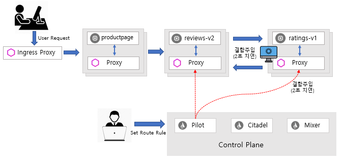
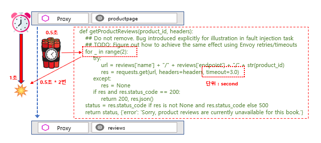
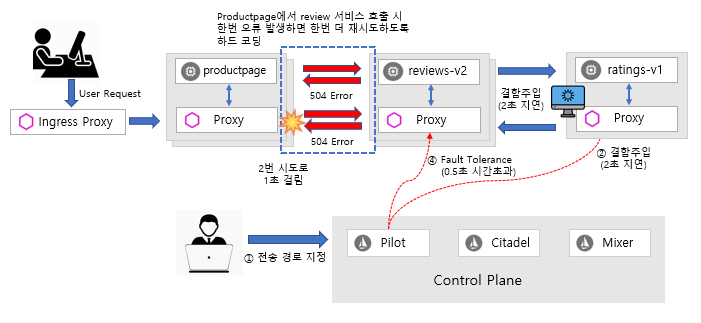

# Hands-on : 시간 초과 요청 \(Request timeouts\)

해당 Hands-on은 Istio를 사용하여 사이드카 프록시\(Envoy proxy, sidecar proxy\)에서 요청 시간 초과를 설정하는 방법을 보여줍니다.

좀 더 상세하게 예제를 설명하면 어플리케이션에서 시간 초과\(Timeout\)을 통하여 서비스 복원성\(Service Resiliency\)를 추가하는 방법을 보여주는 예제로 ratings 서비스에 대하여 2초의 시간 지연\(delay fault Injection\)을 설정하여 reviews 서비스가 1초 이내에 응답하지 않으면 productpage 웹페이지에서 reviews 서비스에 대한 오류 메세지를 보여줍니다.

### 준비 작업

* 아래 사이트에 있는 설치 안내서의 지침에 따라 Istio를 설정하세요. [https://istio.io/docs/setup/kubernetes/install/](https://istio.io/docs/setup/kubernetes/install/)
* 기본 대상 규칙\(default destination rules\)을 포함하여 Bookinfo 샘플 어플리케이션을 배포하세요.
* 다음 명령으로 모든 요청이 Bookinfo 어플리케이션내에 있는 v1 \(Version 1\)을 서비스별로 호출할 수 있도록 변경합니다.

  ```bash
    $kubectl apply -f samples/bookinfo/networking/virtual-service-all-v1.yaml
  ```

  ```text
    apiVersion: networking.istio.io/v1alpha3
    kind: VirtualService
    metadata:
      name: productpage
    spec:
      hosts:
      - productpage
      http:
      - route:
        - destination:
            host: productpage
            subset: v1
    ---
    apiVersion: networking.istio.io/v1alpha3
    kind: VirtualService
    metadata:
      name: reviews
    spec:
      hosts:
      - reviews
      http:
      - route:
        - destination:
            host: reviews
            subset: v1
    ---
    apiVersion: networking.istio.io/v1alpha3
    kind: VirtualService
    metadata:
      name: ratings
    spec:
      hosts:
      - ratings
      http:
      - route:
        - destination:
            host: ratings
            subset: v1
    ---
    apiVersion: networking.istio.io/v1alpha3
    kind: VirtualService
    metadata:
      name: details
    spec:
      hosts:
      - details
      http:
      - route:
        - destination:
            host: details
            subset: v1
    ---
  ```

* 위의 가상 서비스 \(Virtual Service\) 적용 후 웹 브라우저에서 다음과 같은 웹페이지를 확인할 수 있습니다.

  

* 사용자 요청에 대한 서비스 흐름은 다음과 같으며 reviews:v1 서비스는 ratings 서비스를 호출하지 않기 때문에 productpage 웹페이지는 rating 관련 정보를 볼 수 없습니다.

  

### 요청 시간 초과 \(Request timeouts\)

전송 경로 규칙\(route rule\)의 제한 시간 필드\(timeout field\)를 사용하여 HTTP 요청에 대한 제한 시간을 설정할 수 있습니다. 기본적으로 시간 초과\(timeout\)는 비활성화되어 있지만 이 작업에서는 reviews 서비스 시간 초과\(service timeout\)를 1초로 설정합니다. 그러나 그 효과를 확인하기 위해서는 ratings 서비스 호출\(call\)에 에 대하여 2초의 시간 지연\(delay\)을 설정해야 합니다.

1. ratings 서비스를 호출하는 reviews:v2 서비스쪽으로 요청\(Request\)을 보낼 수 있는 가상서비스 \(Virtual Service\)를 설정합니다.

   ```bash
    $ kubectl apply -f - <<EOF
    apiVersion: networking.istio.io/v1alpha3
    kind: VirtualService
    metadata:
      name: reviews
    spec:
      hosts:
        - reviews
      http:
      - route:
        - destination:
            host: reviews
            subset: v2
    EOF
   ```

2. ratings 서비스 호출\(call\)될 때 2초의 시간 지연\(delay\)이 발생되도록 가상서비스\(Virtual Service\)를 설정합니다.

   ```bash
    $ kubectl apply -f - <<EOF
    apiVersion: networking.istio.io/v1alpha3
    kind: VirtualService
    metadata:
      name: ratings
    spec:
      hosts:
      - ratings
      http:
      - fault:
          delay:
            percent: 100
            fixedDelay: 2s
        route:
        - destination:
            host: ratings
            subset: v1
    EOF
   ```

3. 브라우저에서 Bookinfo에 대한 URL\([http://$GATEWAY\_URL/productpage\)를](http://$GATEWAY_URL/productpage%29를) 접속하여 서비스를 확인합니다.

   

   Bookinfo 어플리케이션이 정상적으로 작동하는 것을 볼 수 있지만 \(ratings서비스의 별들이 표시됨\) 페이지를 리플레쉬\(refresh\)할 때 마다 2초의 시간 지연 \(delay\) 되고 이유는 아래와 같습니다.

   위의 \(1\)번 설정에서는 모든 요청\(request\)를 reviews 서비스의 v2으로 전송\(routing\)하고 위의 \(2\)번 설정에서는 ratings 서비스 호출할 때 2초 지연 결함을 주입\(delay Fault Injection\)했기 때문입니다.

   

4. 이제는 reviews 서비스 호출 대상으로  0.5초의 요청 시간 제한\(request timeout\)을 추가합니다.

   ```bash
    $ kubectl apply -f - <<EOF
    apiVersion: networking.istio.io/v1alpha3
    kind: VirtualService
    metadata:
      name: reviews
    spec:
      hosts:
      - reviews
      http:
      - route:
        - destination:
            host: reviews
            subset: v2
        timeout: 0.5s
    EOF
   ```

5. Bookinfo 웹페이지를 리플레쉬\(refresh\) 하면 2초가 아닌 약 1초 후에 반환되며 reviews는 사용할 수 없음을 알 수 있습니다.

   

   

   시간 초과\(timeout\)가 0.5초로 구성되어 있어도 응답이 1초가 걸리는 이유는 productpage 서비스에 하드 코딩 된 재시도 \(hard-coded retry\)가 있기 때문에 리턴하기 전에 시간 초과된 reviews 서비스 \(timing out\)를 두 번 호출\(call\)하기 때문입니다.

#### \[참고사항\] istio/samples/bookinfo/src/productpage/productpage.py 에서 reviews 서비스 호출 부분 



### 무슨 일이 일어났는지를 이해하기 \(Understanding what happened\)

이 작업에서는 Istio를 사용하여 reviews 마이크로 서비스 호출\(call\)에 대한 요청 시간 초과\(request timeout\)를 0.5초로 설정했습니다. 기본적으로 요청 시간 초과 \(request timeout\)는 비활성화되어 있습니다. reviews 서비스는 이후에 처리되는 요청은 ratings 서비스를 호출하기 때문에 Istio를 사용하여 ratings 호출에 2초의 지연\(delay\)을 주입\(inject\)하여 ratings 서비스에 연결 및 처리 완료하는데 0.5초 이상 걸리므로 시간 초과\(timeout\)가 실제로 발생하는 것을 볼 수 있습니다.

reviews 데이터를 보여주는 대신 Bookinfo product 페이지 \(페이지를 채우려면 reviews 서비스를 호출 함\)에 다음과 같은 메시지를 보여줍니다.


```text
  Sorry, product reviews are currently unavailable for this book.
```

이것은 reviews 서비스에서 시간 초과 오류 \(timeout error\)가 발생한 결과입니다.



결함 주입 작업\(fault injection task\)을 검토하면 productpage 마이크로 서비스에는 또한 reviews 마이크로 서비스 호출을 위한 자체 어플리케이션 레벨 시간 초과 \(3초\)가 있음을 알 수 있습니다. 이 작업에서는 Istio 전송 경로 규칙\(Istio route rule\)을 사용하여 시간 초과\(timeout\)를 0.5초로 설정했습니다. 대신에 시간 제한을 3초 \(예 : 4초\)보다 큰 값으로 설정 한 경우 시간 제한\(timeout\)이 좀 더 제한적이기 때문에 시간 제한\(timeout\)에 영향을 미치지 않습니다.

#### \[참고사항\] istio/samples/bookinfo/src/productpage/productpage.py 에서 reviews 서비스 호출 부분 

Istio에서 시간 초과\(timeout\)에 대해 한 가지 더 주의사항은 작업 같이 경로 규칙\(route rule\)에서 시간 초과\(timeout\)를 재정의하는 것 외에도 어플리케이션에서 아웃바운드 요청 \(outbound request\)의 헤더에서 "x-envoy-upstream-rq-timeout-ms"는 시간 초과\(timeout\)는 초\(second\)가 아닌 밀리 초\(milliseconds\)로 설정합니다.

### 정리

어플리케이션 전송 경로 규칙\(routing rule\) 제거

```bash
$kubectl delete -f samples/bookinfo/networking/virtual-service-all-v1.yaml
```

