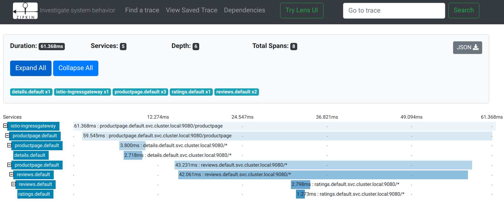

# 6. Observability \(BM\)

ref: [https://istio.io/v1.6/docs/concepts/observability/](https://istio.io/v1.6/docs/concepts/observability/)

## Observability

Istio는 메시\[mesh\] 내의 모든 서비스 통신에 대한 상세  원격 분석\[telemetry\]을 생성할 수 있습니다. 이 원격 측정\[telemetry\]은 서비스 동작에 대한 관찰성\[observability\]을 제공하여 운영자가 서비스 개발자에게 추가 부담을 주지 않고 애플리케이션 문제를 해결하고, 유지 관리하고 최적화 할 수 있게 유용한 정보를 제공 받을 수 있게 합니다. Istio를 통해 운영자는 모니터링 되는 서비스가 다른 서비스 및 Istio 구성 요소와 상호 작용하는 방식을 이해할 수 있게 도와 줍니다.

Istio는 전체적인 서비스 메시\[mesh\] 관찰성\[observability\]을 제공하기 위해 다음 유형의 원격 분석\[telemetry\]을 생성합니다.

* Metrics\[link\]: Istio는 4 가지 모니터링\[monitoring\] "골든 신호\[golden signal\]" \(대기 시간\[latency\], 트래픽\[traffic\], 오류\[errors\] 및 포화 상태\[saturation\]\)를 기반으로 서비스 메트릭 세트를 생성합니다. Istio는 메시 컨트롤 플레인\[mesh control plane\]에 대한 자세한 메트릭\[metrics\]도 제공합니다. 이러한 메트릭\[metrics\] 위에 구축 된 기본 메시\[mesh\] 모니터링\[monitoring\] 대시 보드 세트도 제공됩니다.
* Distributed Traces\[link\]: Istio는 각 서비스에 대한 분산 추적 스팬\[distributed trace spans\]을 생성하여 운영자에게 메시\[mesh\] 내 호 흐름 및 서비스 종속성에 대한 자세한 이해를 제공할 수 있습니다.
* Access Logs\[link\]: 트래픽\[traffic\]이 메시\[mesh\] 내의 서비스로 유입되면 Istio는 소스 및 대상 메타 데이터를 포함하여 각 요청에 대한 전체 레코드를 생성 할 수 있습니다. 이 정보를 통해 운영자는 개별 워크로드 인스턴스 수준까지 서비스 동작을 감사 할 수 있습니다.

### Metrics

Metrics provide a way of monitoring and understanding behavior in aggregate.

To monitor service behavior, Istio generates metrics for all service traffic in, out, and within an Istio service mesh. These metrics provide information on behaviors such as the overall volume of traffic, the error rates within the traffic, and the response times for requests.

In addition to monitoring the behavior of services within a mesh, it is also important to monitor the behavior of the mesh itself. Istio components export metrics on their own internal behaviors to provide insight on the health and function of the mesh control plane

#### Proxy-level metrics

Istio metrics collection begins with the sidecar proxies \(Envoy\). Each proxy generates a rich set of metrics about all traffic passing through the proxy \(both inbound and outbound\). The proxies also provide detailed statistics about the administrative functions of the proxy itself, including configuration and health information.


Envoy-generated metrics provide monitoring of the mesh at the granularity of Envoy resources \(such as listeners and clusters\). As a result, understanding the connection between mesh services and Envoy resources is required for monitoring the Envoy metrics.


Istio enables operators to select which of the Envoy metrics are generated and collected at each workload instance. By default, Istio enables only a small subset of the Envoy-generated statistics to avoid overwhelming metrics backends and to reduce the CPU overhead associated with metrics collection. However, operators can easily expand the set of collected proxy metrics when required. This enables targeted debugging of networking behavior, while reducing the overall cost of monitoring across the mesh.


The Envoy documentation site includes a detailed overview of Envoy statistics collection. The operations guide on Envoy Statistics provides more information on controlling the generation of proxy-level metrics.


Example proxy-level Metrics:

```text
envoy_cluster_internal_upstream_rq{response_code_class="2xx",cluster_name="xds-grpc"} 7163

envoy_cluster_upstream_rq_completed{cluster_name="xds-grpc"} 7164

envoy_cluster_ssl_connection_error{cluster_name="xds-grpc"} 0

envoy_cluster_lb_subsets_removed{cluster_name="xds-grpc"} 0

envoy_cluster_internal_upstream_rq{response_code="503",cluster_name="xds-grpc"} 1
```

#### Service-level metrics <a id="service-level-metrics"></a>

In addition to the proxy-level metrics, Istio provides a set of service-oriented metrics for monitoring service communications. These metrics cover the four basic service monitoring needs: latency, traffic, errors, and saturation. Istio ships with a default set of dashboards for monitoring service behaviors based on these metrics.


The standard Istio metrics are exported to Prometheus by default.


Use of the service-level metrics is entirely optional. Operators may choose to turn off generation and collection of these metrics to meet their individual needs.


Example service-level metric:

```text
istio_requests_total{
  connection_security_policy="mutual_tls",
  destination_app="details",
  destination_canonical_service="details",
  destination_canonical_revision="v1",
  destination_principal="cluster.local/ns/default/sa/default",
  destination_service="details.default.svc.cluster.local",
  destination_service_name="details",
  destination_service_namespace="default",
  destination_version="v1",
  destination_workload="details-v1",
  destination_workload_namespace="default",
  reporter="destination",
  request_protocol="http",
  response_code="200",
  response_flags="-",
  source_app="productpage",
  source_canonical_service="productpage",
  source_canonical_revision="v1",
  source_principal="cluster.local/ns/default/sa/default",
  source_version="v1",
  source_workload="productpage-v1",
  source_workload_namespace="default"
} 214
```

#### Control plane metrics

The Istio control plane also provides a collection of self-monitoring metrics. These metrics allow monitoring of the behavior of Istio itself \(as distinct from that of the services within the mesh\).


For more information on which metrics are maintained, please refer to the reference documentation.

### Distributed traces <a id="distributed-traces"></a>

Distributed tracing provides a way to monitor and understand behavior by monitoring individual requests as they flow through a mesh. Traces empower mesh operators to understand service dependencies and the sources of latency within their service mesh.


Istio supports distributed tracing through the Envoy proxies. The proxies automatically generate trace spans on behalf of the applications they proxy, requiring only that the applications forward the appropriate request context.


Istio supports a number of tracing backends, including Zipkin, Jaeger, Lightstep, and Datadog. Operators control the sampling rate for trace generation \(that is, the rate at which tracing data is generated per request\). This allows operators to control the amount and rate of tracing data being produced for their mesh.


More information about Distributed Tracing with Istio is found in our FAQ on Distributed Tracing.


Example Istio-generated distributed trace for a single request:



### Access logs <a id="access-logs"></a>

Access logs provide a way to monitor and understand behavior from the perspective of an individual workload instance.


Istio can generate access logs for service traffic in a configurable set of formats, providing operators with full control of the how, what, when and where of logging. For more information, please refer to Getting Envoy’s Access Logs.


Example Istio access log:

```text
[2019-03-06T09:31:27.360Z] "GET /status/418 HTTP/1.1" 418 - "-" 0 135 5 2 "-" "curl/7.60.0" "d209e46f-9ed5-9b61-bbdd-43e22662702a" "httpbin:8000" "127.0.0.1:80" inbound|8000|http|httpbin.default.svc.cluster.local - 172.30.146.73:80 172.30.146.82:38618 outbound_.8000_._.httpbin.default.svc.cluster.local
```


